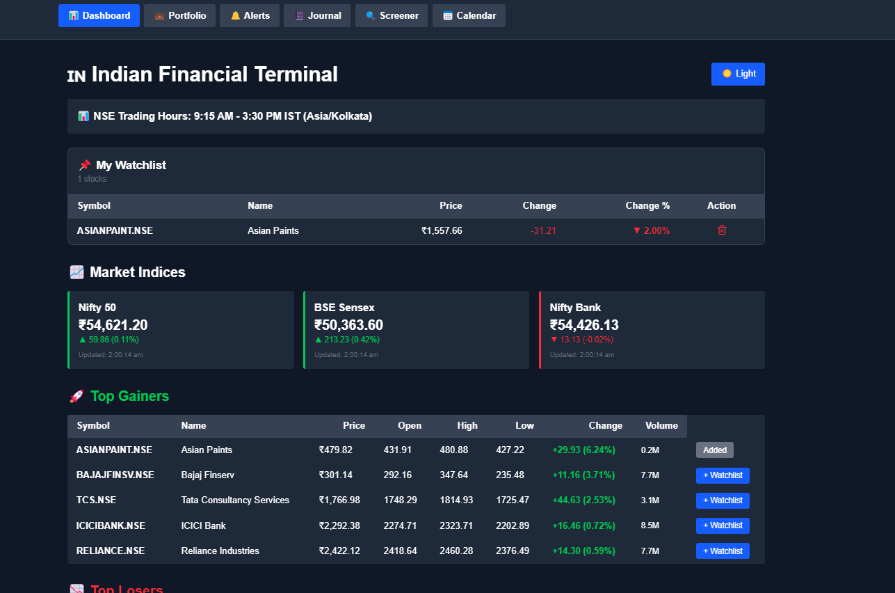
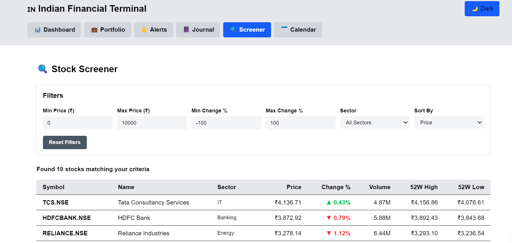
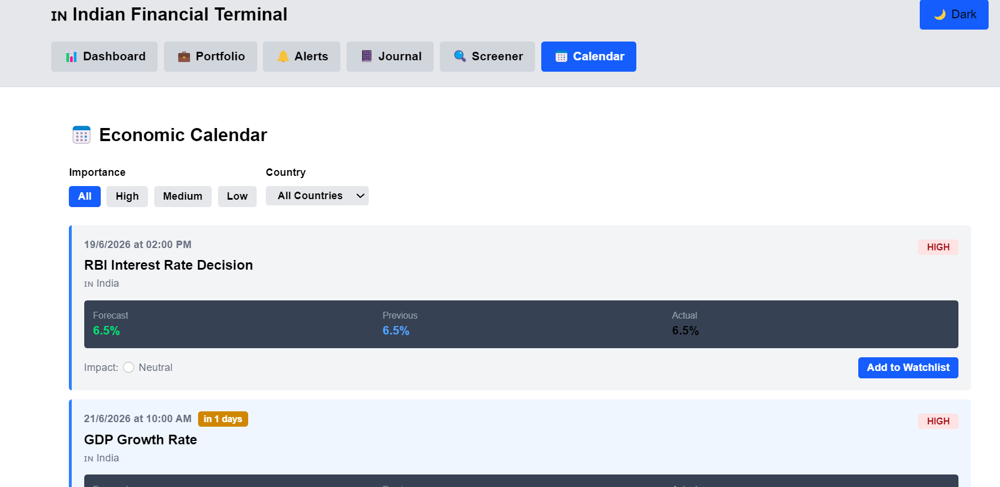
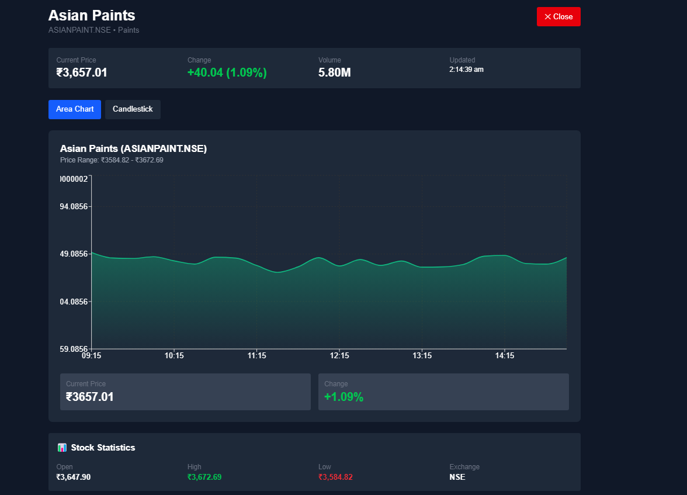
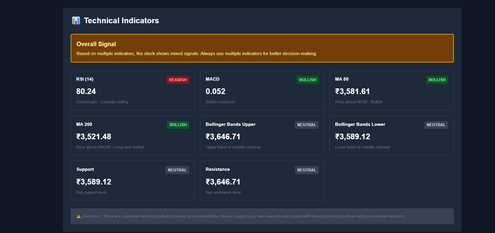
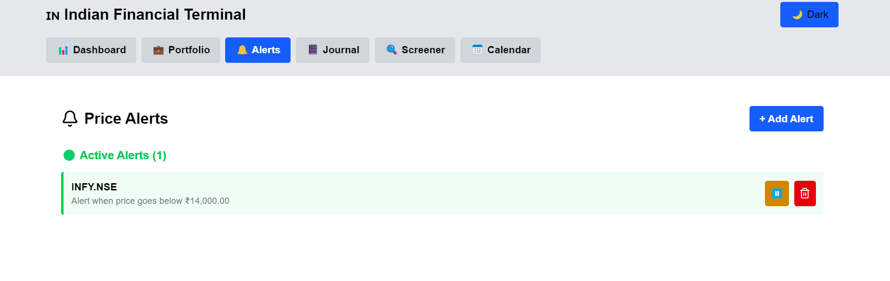
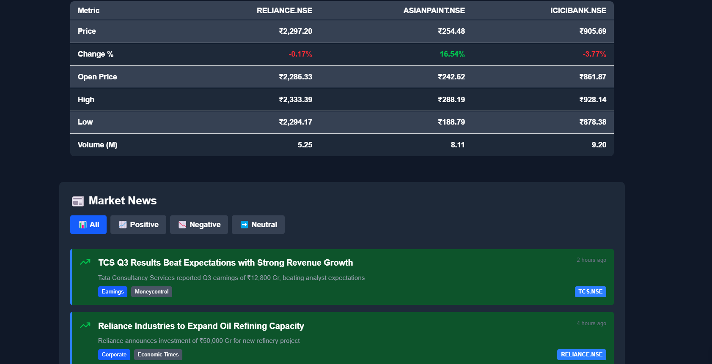

# 🇮🇳 Indian Financial Terminal

A complete and professional Indian stock market trading terminal built with Next.js, React, and TypeScript. The platform provides market insights, portfolio tracking, technical analysis tools, stock screening, price alerts, and financial news in a modern and responsive interface.

---

## 🌟 Features

### 📊 Market Dashboard

* Live NSE/BSE market overview
* Major Indian indices tracking
* Top gainers and losers
* Market sentiment insights

### 📈 Advanced Charting

* Interactive stock price charts
* Candlestick chart visualization
* Historical market analysis
* Trend tracking

### 🔍 Stock Analysis

* Compare multiple stocks side-by-side
* Technical indicators:

  * RSI
  * MACD
  * Moving Averages
  * Bollinger Bands
* Performance comparison tools

### 💼 Portfolio Management

* Track holdings and investments
* Monitor profit/loss
* Portfolio performance overview
* Investment analytics

### 🔔 Smart Alerts

* Custom price alerts
* Target price notifications
* Market movement monitoring

### 📔 Trading Journal

* Record trading activities
* Track win/loss ratio
* Analyze trading performance
* Maintain trading history

### 🔍 Stock Screener

* Filter stocks by:

  * Price
  * Volume
  * Percentage Change
  * Sector
* Discover trading opportunities

### 📅 Economic Calendar

* Important economic events
* Market-impact tracking
* Upcoming announcements

### ⭐ Watchlist

* Create personalized watchlists
* Monitor favorite stocks
* Quick market access

### 📰 Financial News

* Indian market news updates
* Financial headlines
* Market-related information

---

## 🛠️ Tech Stack

### Frontend

* Next.js 15
* React 19
* TypeScript

### UI & Styling

* Tailwind CSS
* shadcn/ui

### Charts & Visualization

* Recharts

### State Management

* React Context API

---

## 📂 Project Structure

```text
app/
├── api/
├── layout.tsx
└── page.tsx

components/
└── indian-terminal/

lib/
types/
```

---

## 🚀 Getting Started

### Clone the Repository

```bash
git clone https://github.com/arpitaa0/indian-financial-terminal.git
cd indian-financial-terminal
```

### Install Dependencies

Using npm:

```bash
npm install
```

Or using pnpm:

```bash
pnpm install
```

### Run Development Server

```bash
npm run dev
```

Open:

```text
http://localhost:3000
```

in your browser.

---

## ✨ Key Highlights

* Modern financial terminal interface
* Responsive design
* Modular component architecture
* Type-safe development with TypeScript
* Portfolio and watchlist management
* Trading analytics and journaling
* Technical analysis tools
* Financial news integration

---

## 📸 Screenshots

### Dashboard


### Stock Screener


### Economic Calendar


### Watchlist


### Technical Indicators


### Price Alerts


### Market News


## 🔮 Future Enhancements

* Real-time NSE/BSE API integration
* User authentication
* Cloud database support
* AI-powered stock insights
* Advanced portfolio analytics
* Export reports and trade history
* Multi-user support

---

## 👩‍💻 Author

**Arpita Muduli**

GitHub: https://github.com/arpitaa0

---

## 📜 License

This project is created for educational, learning, portfolio, and demonstration purposes.
